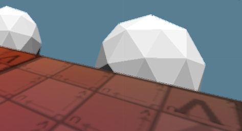

# OM3D
EPITA course for 5th year students

Slides: https://docs.google.com/presentation/d/1qJhH0cmEMVQRhF37UOYDdw0ZKtd00_oQXW1dZrUbSL4/edit

TP1: https://hackmd.io/@G2s9zdzlSd-RfTlBoN_x2A/ryY2BSgVo

TP2&3: https://hackmd.io/@G2s9zdzlSd-RfTlBoN_x2A/Bkm_EOFHo


### How to build
Requirements: cmake 3.20 minimum, C++17, and OpenGL 4.5.
```bash
# At the project root
mkdir -p TP/build/debug
cd TP/build/debug
cmake ../..
make
```

### Authors of base code
If you have a problem, please send a mail to
- alexandre.lamure@epita.fr
- gregoire.angerand@gmail.com

### Authors of the improvements

Yorick Madelain - Ancelin Bouchet

### Features of the project

* Frustum culling
* Backface culling
* Instancing
* Deferred shading
* Volume lightning
* Occlusion culling
* Temporal anti aliasing (TAA)

### Occlusion culling

* Makes use of opengl occlusion queries
* Hierarchy for objects is just front to back
* Doesn't use bounding boxes for dry rendering because it would break everything
* Disables instancing


### TAA

* Accumulates multiple frames to smooth contours removing aliasing
* Camera moves a little each frame (jitter) to add variation, pixel may be filled or not with the correct probabilities on edges
  * Jitter values generated using the repeated first 16 values of a Halton (2,3) sequence
* Double buffered color and depth textures for historisation
* Sampling current frame by weighted averaging 3x3 neighbourhood (filter: Mitchell-Netravali)
* History sampled with closest (depth) velocity then clipped around current sample neighbourhood
  * Both of these help reject sample when disocclusion happens
* Mix between current and history sample favoring history heavily, depending on luminance



*Some artifacts are present*
